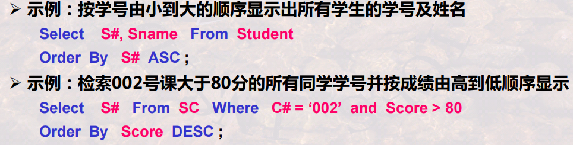

# 哈工大DB-第6讲SQL语言概览

[TOC]


## 0.本讲学什么

1. SQL语言概述?
2. SQL语言之DDL-定义数据库
3. SQL语言之DML-操纵数据库

重点与难点：

- SQL-DDL的基本语句：CREATE DATABASE, CREATE TABLE
- SQL-DML的基本语句：INSERT, DELETE，UPDATE, SELECT
- SQL-SELECT语句的训练：正确表达各种查询需求

## 1.SQL语言概述

### 1.1历史

- 1974年，由Boyce和Chamber提出。
- 975-1979年，由IBM的SanJose研究室在SystemR上首次实现，称为Sequel(Structured English QUEry Language) SQL(Structured Query Language)。
- 1986年ANSI/ISO推出SQL标准：SQL-86
- 1989年ANSI/ISO推出SQL标准:SQL-89
- 1992年进一步推出了SQL标准：SQL-92，也称为SQL2是SQL-89的超集
  - 增加了新特性，如新数据类型，更丰富数据操作，更强完整性支持等
  - 原SQL-89被称为entry-SQL,扩展的被称为Intermediate级和Full级
- 1999年进一步推出了SQL标准： SQL-99，也称为SQL3
  - 对面向对象的一些特征予以支持，支持抽象数据类型
  - 支持行对象和列对象等
  - 对递归、触发等复杂操作也予以规范化定义
  - 废弃了SQL2的分级，但定义了core-SQL及扩展的SQL
  - SQL 2003;SQL 2006;SQL 2008。
- SQL还有一个标准是SQL X/Open标准，主要强调各厂商产品的可移植性，只包含被各厂商广泛认可的操作
  - “标准”主要用于衡量一个软件商的产品是否符合共同的约定。
  - “标准”使得用户可以学习“标准”规定的语言，而无需关注具体的软件产品。但也应注意不同软件商的数据库产品满足的标准可能是不一样的，具体应用还是略有差异。

### 1.2功能概述

- SQL语言是集DDL、DML和DCL于一体的数据库语言
- SQL语言主要由以下**9个单词引导的操作语句**来构成，但每一种语句都能表达复杂的操作请求
  - **DDL语句引导词**：**Create(建立),Alter(修改),Drop(撤消)**
    - 模式的定义和删除，包括定义Database,Table,View,Index,完整性约束条件等，也包括定义对象(RowType行对象,Type列对象)
  - **DML语句引导词**：**Insert ,Delete, Update, Select**
      - 各种方式的更新与检索操作，如直接输入记录，从其他Table(由SubQuery建立)输入
      - 各种复杂条件的检索，如连接查找，模糊查找，分组查找，嵌套查找等
      - 各种聚集操作，求平均、求和、…等，分组聚集，分组过滤等
  - **DCL语句引导词**：**Grant,Revoke**
      - 安全性控制：授权和撤消授权
      - 交互式SQL、嵌入式SQL、动态SQL等

## 2.利用SQL建立数据库(创建数据库、创建表、插入元组)

### 2.0 建立数据库的概述

**建立数据库包括两件事：定义数据库和表（使用DDL）,向表中追加元组（使用DML）**

DDL: Data Definition Language

- **创建数据库(DB)--<font color=blue>Create Database</font>**
- **创建DB中的Table(定义关系模式)--<font color=blue>Create Table</font>**
  - 定义Table及其各个属性的约束条件(定义完整性约束)
  - 定义View (定义外模式及E-C映像)
  - 定义Index、Tablespace… …等(定义物理存储参数)
  - 上述各种定义的撤消与修正
  - DDL通常由DBA来使用，也有经DBA授权后由应用程序员来使用

### 2.1 创建数据库

**创建Database**

- 数据库(Database)是若干具有相互关联关系的Table/Relation的集合

- 数据库可以看作是一个集中存放若干Table的大型文件

- **create database的简单语法形式：**

  - ```mysql 
    create database 数据库名;
    ```

- 示例：创建课程学习数据库SCT

  - ```mysql
    create database SCT;
    ```

在mysql中，创建结束之后可以使用use 数据库名字; 来使用数据库。

使用quit;或者exit;退出

不区分大小写的，命令可以多行，使用分号结束

### 2.2 创建表

**创建Table**

- create table简单语法形式：

- ```mysql
  Create table 表名(列名 数据类型 [Primary key |Unique][Not null], 列名 数据类型 [Not null] , …);
  ```

- “ [ ] ”表示其括起的内容可以省略，“ | ” 表示其隔开的两项可取其一

- Primary key: 主键约束。每个表只能创建一个主键约束。

- Unique: 唯一性约束(即候选键)。可以有多个唯一性约束。

- Not null: 非空约束。是指该列允许不允许有空值出现，如选择了Not null表明该列不允许有空值出现。

- 语法中的数据类型在SQL标准中有定义

#### SQL92数据类型

在SQL-92标准中定义的数据类型

- char (n) :固定长度的字符串
- varchar (n) :可变长字符串
- int :整数 //  有时不同系统也写作integer
- numeric (p，q) :固定精度数字，小数点左边p位，右边p-q位
- real  :浮点精度数字 //有时不同系统也写作float(n)，小数点后保留n位
- date :日期 (如 2003-09-12)
- time  : 时间 (如 23:15:003)
- 现行商用DBMS的数据类型有时和上面有些差异，请注意;和高级语言的数据类型，总体上是一致的，但也有些差异。

尝试：


在实验楼上面尝试了一下，唯一的问题好像就是名字里面不能有特殊字符？emm

### 2.3 插入元组

**向表中追加元组**

- insert into简单语法形式：

- ```mysql
  insert into 表名 [(列名 , 列名…)] values (值 , 值 …) ;
  ```

- values后面值的排列，须与into子句后面的列名排列一致

- **若表名后的所有列名省略， 则values后的值的排列，须与该表存储中的列名排列一致**

尝试：


在实验楼上面尝试了一下，插入char的时候要把字符串用' '括起来

## 3.SQL简单的查询

### 3.1 单表查询--select-from-where

```mysql
Select 列名 [[, 列名] … ]
From 表名
[ Where  检索条件 ] ;
```

- 语义：从表名所给出的表中，查询出满足检索条件的元组，并按给定的列名及顺序进行投影显示。
- 相当于：$\prod_{列名,...,列名}(\sigma_{检索条件}(表名))$
- Select语句中的select … , from… , where…, 等被称为子句，在以上基本形式基础上会增加许多构成要素，也会增加许多新的子句，满足不同的需求。


### 3.2检索条件的书写

where后面的条件:

- 用 大于小于等于不等于 等 运算符给出条件
- 不同的条件用 and or not 以及 括号 连接

### 3.3保证结果唯一性的检索--select-distinct-from-where

```mysql
Select Distinct 列名 [[, 列名] … ]
From 表名
[ Where  检索条件 ] ;
```

- **在Table中**要求无重复元组是通过**定义Primary key或Unique**来保证的
- **在检索结果中**要求无重复元组, 是通过**DISTINCT保留字**的使用来实现的


### 3.4对结果排序--select-from-where-order by

```mysql
Select 列名 [[, 列名] … ]
From 表名
Where  检索条件
Order by 列名 [asc | desc]
```

- 意义为检索结果**按指定列名进行排序**，若后跟asc或省略，则为升序；若后跟desc, 则为降序。



### 3.5模糊查询--select-from-where-like

```mysql
Select 列名 [[, 列名] … ]
From 表名
Where [列名 like/ not like "字符串"] 
```

- **找出匹配给定字符串的字符串**。其中给定字符串中可以出现%, _等匹配符.

  - **匹配规则：**
    - “%” 匹配**零个或多个字符**
    - “_” 匹配任意**单个字符**
    - “$\backslash$ ” 转义字符，用于**去掉一些特殊字符的特定含义，使其被作为普通字符看待**, 如用 “$\backslash\%$”去匹配字符%，用$\backslash \_$ 去匹配字符_

  

## 4.SQL多表联合查询

### 4.1概述

**多表联合检索**可以通过**连接运算**来完成，而**连接运算**又可以通过**广义笛卡尔积后再进行选择运算**来实现。

```mysql
Select 列名 [[, 列名] … ]
From 表名1,表名2...
[ Where  检索条件 ] ;
```

- 相当于：$\prod_{列名,...,列名}(\sigma_{检索条件}(表名1 \times表名2\times...))$
- 检索条件中要包含**连接条件**，通过不同的连接条件可以实现**等值连接**、**不等值连接**及各种$\theta$-连接

### 4.2等值连接


- 多表连接时，如果同一个属性名出现在多个表中，需要用**表名.属性名**来限定是哪个表中的属性

### 4.3表别名与列别名--处理连接时表/列重名的问题

- 连接运算涉及到重名的问题，如两个表中的属性重名，连接的两个表重名(同一表的连接)等，**因此需要使用别名以便区分**

```mysql
Select 列名 as 列别名 [ [, 列名 as 列别名] … ]
From 表名1 as 表别名1, 表名2 as 表别名2, …
Where 检索条件 ;
```

- 上述定义中的as可以省略
- 当定义了别名后，在检索条件中可以使用别名来限定属性

### 4.4不等值连接


## 5.SQL增-删-改

### 5.1概述

- 元组新增Insert：新增一个或一些元组到数据库的Table中
- 元组更新Update:对某些元组中的某些属性值进行重新设定
- 元组删除Delete：删除某些元组

### 5.2Insert

元组新增Insert命令有两种形式:

- 单一元组新增命令形式：插入一条指定元组值的元组
  - ```mysql
  	insert into 表名 [(列名[，列名]…)]
  	values (值 [，值]…);
  	```
- 批数据新增命令形式：插入子查询结果中的若干条元组。待插入的元组由子查询给出。
  - ```mysql
		insert into 表名 [(列名[，列名]…)]
  	子查询;
  	```


### 5.3Delete

```mysql
Delete From 表名 [ Where 条件表达式] ;
```

- 元组删除Delete命令: 删除满足指定条件的元组
- 如果Where条件省略，则删除所有的元组。


### 5.4Update

```mysql
Update 表名
Set 列名 = 表达式 | (子查询) 
[ [ , 列名 = 表达式 | (子查询) ] … ]
[ Where 条件表达式] ;
```

- 元组更新Update命令: 用指定要求的值更新指定表中满足指定条件的元组的指定列的值
- 如果Where条件省略，则更新所有的元组。


上面的这个图的下面一个例子就是子查询的一个示例


## 6.SQL修正与撤销数据库

### 6.1修正表的定义

```mysql
alter table tablename
[add {colname datatype, …}] 增加新列
[drop {完整性约束名}] 删除完整性约束
[modify {colname datatype, …}] 修改列定义
```


### 6.2撤销基本表

```mysql
drop table 表格名字
```

- SQL-delete语句只是删除表中的元组
- 撤消基本表droptable的操作是**撤消包含表格式、表中所有元组、由该表导出的视图等相关的所有内容**
- 使用要特别注意

### 6.3撤销数据库

```mysql
drop database 数据库名字
```


### 6.4指定当前操作的数据库

```mysql
use 数据库名字;
```


### 6.5关闭数据库

```mysql
close 数据库名字;
```

