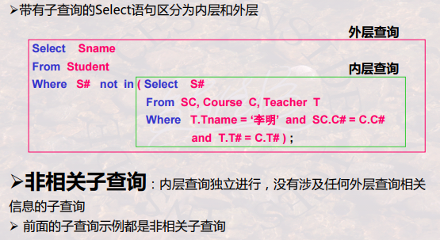

# 哈工大DB-第7讲SQL语言--查询与视图


[TOC]

可能用到的表格:


## 0.本讲学什么

基本内容
1. SQL语言之子查询运用
2. SQL语言之结果计算与聚集函数
3. SQL语言之分组查询与分组过滤
4. 利用SQL语言实现关系代数操作
5. SQL语言之视图及其应用

重点与难点：

- SQL-SELECT：IN | NOT IN, $\theta$ some, $\theta$ all, Exists | NOT Exists
- SQL-SELECT：聚集函数，GROUP BY, HAVING
- 视图及其应用

### 子查询

- 子查询：**出现在Where子句中的Select语句**被称为**子查询(subquery)** 
  - 子查询返回了一个集合
  - 可以通过与这个集合的比较来确定另一个查询集合
- 三种类型的子查询：
  - (NOT) IN-子查询
  - $\theta$-Some | $\theta$-All子查询；
  - (NOT) EXISTS子查询
- 为什么需要子查询？
  - 现实中，很多情况需要进行下述条件的判断
    - 集合成员资格
      - 某一元素是否是某一个集合的成员
    - 集合之间的比较
    	- 某一个集合是否包含另一个集合等
    - 集合基数的测试
      - 测试集合是否为空
      - 测试集合是否存在重复元组

## 1.IN | NOT IN 子查询

### 1.1基本

```mysql
表达式 [not] in (子查询)
```

- 语法中，表达式的最简单形式就是列名或常数。
- 语义：判断某一表达式的值是否在子查询的结果中。

示例:


### 1.2相关子查询和非相关子查询




- **需要重点关注相关子查询和非相关子查询的区别**
  - 非相关子查询则是，子查询执行完毕返回给一个集合，然后外部查询在此集合中再次查询。共计两次。即从内到外执行。
  - 相关子查询则是，外部子查询每执行一次，将会把结果中的参量传递给内层查询，然后内层查询都进行一次查询。即从外到内执行。

## 2. $\theta$ some, $\theta$ all 子查询

### 2.1 基本

基本语法：

```mysql
表达式 比较运算符 some ( 子查询)
表达式  比较运算符 (子查询)
```

- 语法中， 比较运算符： < , > , >= , <= , = , <>。
- 语义：将表达式的值与**子查询的结果进行比较**：
  - 如果**表达式的值至少与子查询结果的某一个值相比较满足关系**，则“表达式 比较运算符 some (子查询)””的结果便为真；
  - 如果**表达式的值与子查询结果的所有值相比较都满足关系**，则“表达式 比较运算符 all (子查询)””的结果便为真；

示例：


- 上面的相关子查询即 查询到的每个结果的那个参数都会传输进去，进行子查询


### 2.2等价表达式


## 3.EXISTS | NOT EXISTS子查询

## 4.结果计算与聚集计算

## 5.分组查询与分组过滤

## 6.SQL实现关系代数操作

## 7.SQL视图与应用

